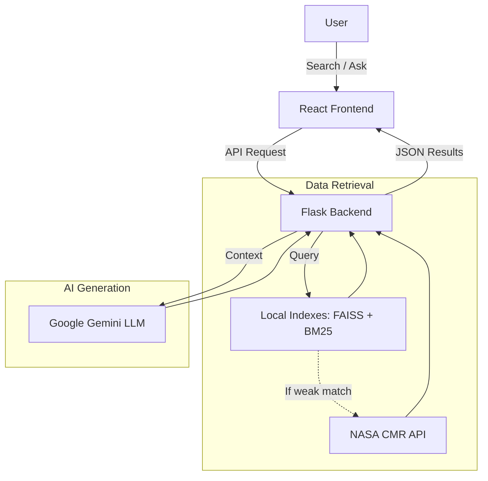
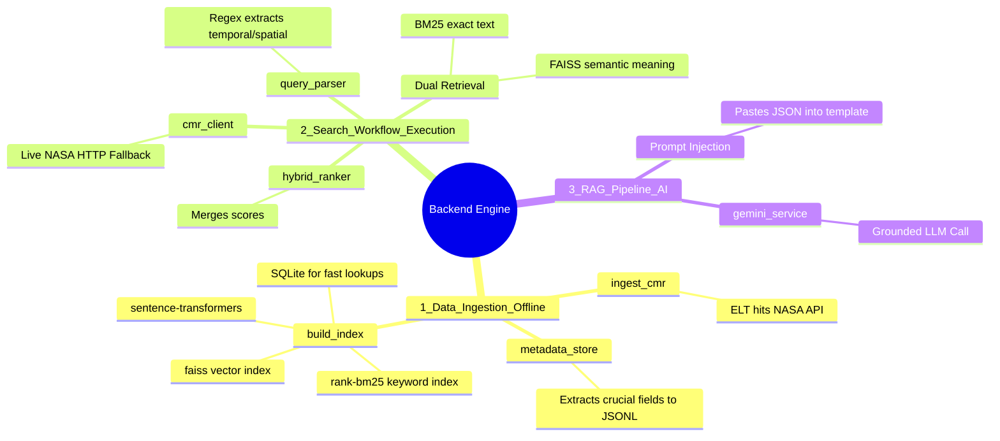
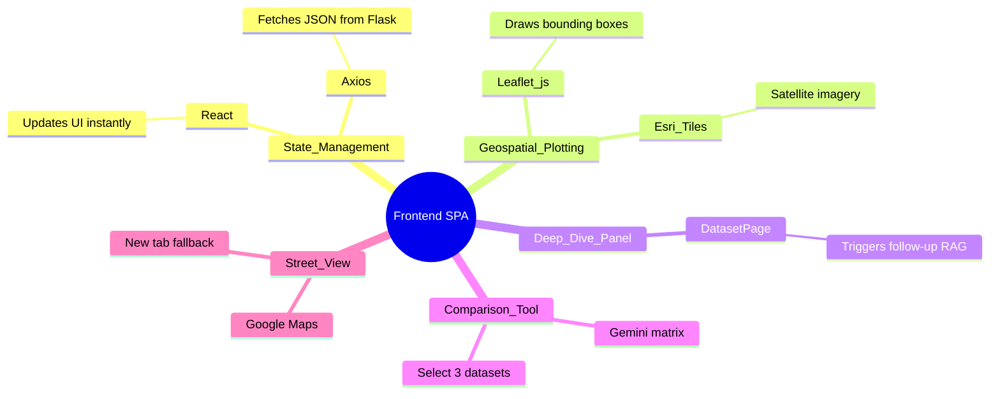

# GeoScope Technical Revision Notes & Interview Prep

## PART I: High-Level Overview & Agenda

### 1. The Core Concept
**Problem Statement:** Finding Earth science data from NASA's Common Metadata Repository (CMR) requires domain expertise and navigating clunky API interfaces that rely purely on rigid keyword matching. Non-experts struggle to find, interpret, and utilize this highly technical metadata.

**Existing Solutions & Issues:** Traditional metadata catalogs built directly on top of NASA CMR (like NASA Earthdata Search) suffer from rigid keyword constraints. For example, searching "floods" completely misses datasets tagged with "inundation". The CMR metadata is heavily nested, and standard workflows force users to jump between disconnected tools for search, mapping, and reading documentation.

**Project Idea (GeoScope):** A full-stack Earth-data discovery app that bridges the gap between everyday users and NASA's CMR API. It combines Hybrid Search (Lexical BM25 + Semantic FAISS) and Grounded LLM RAG (Google Gemini) to let users search the CMR catalog via natural language, view datasets on an interactive map, and ask questions without AI hallucinations.

### 2. The Core Agenda: A Smart Middle-Layer
GeoScope doesn't try to change NASA's complex search algorithm. Instead, it acts as a smart middle-layer that makes NASA's data easy for everyday people to search and understand.
1. **Bypassing NASA with a Smarter Local Engine:** Rather than relying purely on NASA's basic keyword matching, GeoScope uses a custom local Hybrid Search Engine (FAISS + BM25) to understand semantic intent.
2. **Translating Human Language to "NASA Code":** If forced to hit the live CMR API, the NLP parser intercepts natural language (e.g., "India 2019") and strictly formats it into the rigid bounding box and temporal parameters NASA requires, effectively outsmarting the rigid API.
3. **Translating "NASA Code" to Human Language (RAG):** When highly technical, jargon-heavy JSON metadata is retrieved, the RAG pipeline injects it into Gemini to output an easy-to-read, grounded Layman's Summary.

### 3. The Tech Stack & Definitions
*A detailed breakdown of every technology powering the application and its specific role.*

**Frontend Stack**
- **React**: A component-driven JavaScript library used to build the interactive UI state for the Discovery Workspace.
- **Vite**: A fast build tool and bundler. It serves the React Single Page Application (SPA) and provides Hot Module Replacement (HMR) for real-time browser updates during development.
- **Axios**: A promise-based HTTP client heavily utilized in `client.js` to perform asynchronous API calls to the Flask backend, handling JSON parsing automatically.
- **Leaflet.js**: An extremely lightweight open-source JavaScript library used to render interactive maps with dataset bounding boxes and markers.
- **Esri Tiles**: A geographic information system (GIS) mapping service. GeoScope integrates Esri's satellite and boundary tile endpoints into Leaflet.js for high-resolution map backgrounds.
- **Spline 3D**: A web-based 3D design tool. GeoScope embeds a Spline 3D scene to render an interactive, visually stunning animated background for the landing page without heavy WebGL boilerplate.

**Backend Stack**
- **Python**: The core programming language used for the backend due to its massive AI/ML ecosystem.
- **Flask**: A lightweight WSGI web application framework in Python. It provides a robust REST API layer to bridge the frontend with the local machine learning models.
- **Gunicorn**: A Python Web Server Gateway Interface (WSGI) HTTP server used in GeoScope's production deployment on Render to handle multiple concurrent API requests robustly.
- **CORS (Cross-Origin Resource Sharing)**: Implemented in the backend to explicitly allow the Vercel-hosted frontend domain to make secure API requests to the Render-hosted backend.

**Search & AI Engines**
- **FAISS (Facebook AI Similarity Search)**: A vector database library that uses Voronoi cell clustering to perform lightning-fast Approximate Nearest Neighbor (ANN) semantic searches.
- **Sentence-Transformers (`all-MiniLM-L6-v2`)**: A lightweight (80MB) AI model that maps textual summaries into a 384-dimensional dense vector space for FAISS to index.
- **rank-bm25**: A lexical search algorithm that tokenizes text and rewards exact term matches, prioritizing rare words found in titles over common words.
- **TF-IDF**: A traditional statistical text vectorizer used as a lightweight fallback algorithm in GeoScope if the deep learning embedding model fails to load.

**Data Storage & Pipelines**
- **SQLite**: A small, fast, self-contained SQL database engine used locally to provide instant O(1) lookups for dataset metadata during RAG generation.
- **JSONL (JSON Lines)**: An intermediate storage format where every line is a valid JSON object. It allows massive NASA datasets to be processed line-by-line during the ELT (Extract, Load, Transform) ingestion pipeline without overloading RAM.

**External APIs & Deployment**
- **NASA CMR API**: NASA's Common Metadata Repository. GeoScope acts as an intelligent wrapper around this highly nested, rigid keyword database.
- **Google Gemini API**: Powers the Retrieval-Augmented Generation (RAG) architecture. It is injected with retrieved JSON data to act as a grounded research assistant, strictly preventing hallucinations.
- **Vercel & Render**: Cloud hosting platforms. Vercel is highly optimized for hosting the static React frontend, while Render hosts the heavy Python/Flask backend and AI models.

---

## PART II: System Architecture & Workflow

### 4. Simplified System Architecture Diagram

### 5. RAG Pipeline Diagram
*When the interviewer asks how I prevented hallucinations, I walk them through this specific flow:*

### 5. Technical Workflow Example (Step-by-Step)
**Scenario: User searches "floods in India 2019"**
1. **Request**: React sends `GET /api/search?q=floods+in+india+2019` to Flask.
2. **Parsing**: `query_parser.py` extracts `year=2019` and `region=india` (maps to bounding box coordinates). Remaining keyword is `"floods"`.
3. **Retrieval**: FAISS searches for vectors similar to "floods". BM25 searches for exact words "floods".
4. **Ranking**: Results are merged. Datasets inside India and spanning 2019 get massive score boosts.
5. **Auto-Fallback**: If local matches are terrible, Flask makes an HTTP request to the live NASA CMR API and merges the new data.
6. **AI Summary**: Top results go to Gemini to generate bullet points explaining the findings.
7. **Response**: Flask sends JSON back; React renders Leaflet map markers and the summary list.

---

## PART III: Implementation Details

## PART III: Detailed Implementation & Logic

### 6. Backend Implementation (Data, Search, and AI)
*I built the backend in Python/Flask. It acts as the engine, handling data ingestion, dual-retrieval search, and the LLM RAG pipeline.*

**1. Data Ingestion & Indexing (Offline Setup):**
- **Fetching Raw Data (`ingest_cmr.py`)**: I wrote an ELT script that hits the NASA CMR API to pull a specific subset of collections.
- **Normalizing Metadata (`metadata_store.py`)**: Raw NASA JSON is deeply nested and messy. I built logic to extract only crucial fields (Title, Summary, Science Keywords) and save them line-by-line into a `.jsonl` file, preventing the server's RAM from overloading.
- **Building the Vector Engine (`build_index.py`)**: The script reads the `.jsonl` file and uses `sentence-transformers` (`all-MiniLM-L6-v2`) to convert text into 384-dimensional mathematical arrays. These are loaded into `faiss` (clustering them into Voronoi cells) for lightning-fast semantic search. Concurrently, `rank-bm25` builds an exact-keyword index, and `SQLite` stores the raw text for instant O(1) lookups.

**2. Search & Retrieval Workflow (Execution):**
- **NLP Parsing (`query_parser.py`)**: When Flask receives a query like "floods in India 2019", my regex logic extracts the year (`temporal`) and matches the country to a hardcoded bounding box (`spatial`), leaving "floods" as the clean keyword.
- **Dual Retrieval & Ranking (`hybrid_ranker.py`)**: The keyword hits both FAISS (semantic meaning) and BM25 (exact text). The scores are mathematically merged. I apply a "Metadata Quality Score" to boost datasets with valid coordinates and overlapping bounding boxes.
- **The Live NASA Fallback (`cmr_client.py`)**: If the highest local FAISS score is too low, the system dynamically triggers a live HTTP request (`requests` package) to NASA's CMR servers to fetch fresh data using the extracted parameters.

**3. The RAG Pipeline (`rag_service.py`):**
- **Prompt Injection**: The backend extracts the raw JSON metadata for the top retrieved datasets and literally pastes this JSON text directly into a prompt template.
- **Grounded LLM Call (`gemini_service.py`)**: The injected prompt is sent to Google's Gemini LLM. The prompt explicitly commands the LLM to formulate its answer *ONLY* based on the injected JSON, completely preventing AI hallucinations.

### 7. Frontend Implementation & Features
*I built the frontend as a React Single Page Application (SPA) using Vite to serve as the user's interactive Discovery Workspace.*

- **State Management (`React` & `Axios`)**: I use the `Axios` package to fetch the complex JSON payloads from Flask. `React` manages the UI state, displaying the AI's Layman's Summary in the left panel and updating the DOM instantly without page reloads.
- **Geospatial Plotting (`Leaflet.js`)**: The right panel is an interactive map. My React component loops over the retrieved dataset coordinates and uses `Leaflet.js` to draw bounding box rectangles over high-resolution satellite imagery provided by `Esri Tiles`.
- **Deep Dive & Assistant Panel**: If a user clicks a dataset, they are routed to `DatasetPage.jsx`. Here, they can open the Assistant Panel and chat directly with the retrieved datasets, re-triggering the backend RAG pipeline for highly specific follow-up questions.
- **Dataset Comparison Tool**: I built a feature allowing users to select up to three datasets and generate a side-by-side comparison matrix using Gemini.
- **Street View Integration**: I plot Google Maps Street View for specific dataset coordinates. Since embedded Street View is often blocked by browser iframe security, I implemented a robust fallback to open panoramas in a new tab.

---

## PART IV: Interview Preparation & Reference

### 7. AI/ML LLM Interview Q&A (Interviewer's Perspective)
**Q1: Why did you use Hybrid Search (BM25 + FAISS) instead of just Vector Search?**
*Answer*: Vector search is fantastic for semantic meaning (e.g., matching "flood" to "inundation"), but it often fails at exact keyword matching (like searching for a specific dataset ID or acronym like "MODIS"). BM25 excels at exact term frequency. Combining them gives us the best of both worlds.

**Q2: How does FAISS work under the hood?**
*Answer*: A simple loop comparing a query vector to every dataset vector has O(N) complexity, which is slow. FAISS groups vectors into clusters (Voronoi cells) or uses quantization to perform approximate nearest neighbor (ANN) search, reducing search time to sub-milliseconds.

**Q3: Which embedding model did you use for Sentence Transformers and why?**
*Answer*: We used `all-MiniLM-L6-v2`. It produces 384-dimensional vectors. I chose it because it is highly optimized, lightweight, and incredibly fast for CPU-based inference on our free-tier backend.

**Q4: How exactly did you implement Grounded RAG to prevent Gemini from hallucinating?**
*Answer*: Our backend intercepts the query, runs a local Hybrid Search to find relevant NASA datasets, and injects their raw JSON metadata directly into a strict prompt template. The prompt commands the LLM: *"Answer ONLY using the provided dataset JSON. Do not use outside knowledge."*

**Q5: What happens if your deep-learning vector model fails to load in production?**
*Answer*: I engineered a fallback mechanism. If `sentence-transformers` crashes due to RAM limits, the backend catches the exception and falls back to a traditional `TF-IDF` vectorizer using Scikit-Learn.

**Q6: What were the major challenges of working with the raw NASA CMR metadata?**
*Answer*: NASA's JSON schema is heavily nested and inconsistent. Feeding it directly into a vector index causes memory bloat and distracts the LLM. I built an ELT pipeline to flatten the JSON, extracting only high-signal textual data (Titles, Summaries, Science Keywords).

### 9. Technical Concepts Glossary
*Core architectural and mathematical concepts used in the system.*

**RAG (Retrieval-Augmented Generation)**
An AI architecture that grounds Large Language Models on external knowledge sources. By injecting retrieved data directly into the prompt, it restricts the LLM from hallucinating answers based on its training data.

**ELT (Extract, Load, Transform)**
A data integration process. In GeoScope, raw nested JSON is extracted from NASA APIs, transformed (flattened and scored) locally, and loaded into structured JSONL and SQLite tables.

**ANN (Approximate Nearest Neighbor)**
An optimization class of algorithms used in vector databases. Instead of perfectly calculating the exact closest vector (which is slow), it sacrifices a tiny bit of accuracy for massive speed improvements.

**Voronoi Cells**
A mathematical method used by FAISS to partition space into regions based on distance to points. Vectors are grouped into these cells, drastically reducing the search space during similarity matching.
